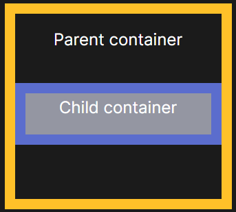

# The Web Developer Bootcamp 2022

## HTML

### Skeleton
```
<!DOCTYPE html>     
<html lang="en">
<head>: Contiene todos los metadatos de nuestra pagina.      
    <meta charset="UTF-8">
    <meta http-equiv="X-UA-Compatible" content="IE=edge">
    <meta name="viewport" content="width=device-width, initial-scale=1.0">
    <title>Document</title>: Define el titulo de nuestro documento.
</head>
<body>: Representa todo el contenido del documento.
    <b></b>
</body>
</html>
```

### Elementos
* p: Representa un parrafo.
* i: Letra cursiva.
* b: letra negrita.
* h1-h6: Encabezados se rigen por jerarquia del 1 al 6. 
* hr: Representa un cambio de tema.
* br: Produce un salto de línea en el texto.
* sup: Agrega un super indice.
* sub: Agrega un sub indice.

### Elementos semanticos
* main: Representa el contenido principal del documento.
* nav: Se usa para brindar navegacion en el documento.
* section: Representa una seccion independiente.
* article: Representa una composición auto-contenida en un documento
* aside: parte del documento que se relaciona solo indirectamente con resto. 
* Header: Encabezados, contenido introductorio. 
* Footer: Pie de página para el contenido de sección
* figure: Contenido independiente, a menudo con un título.
```
<main>
    <section>
        <h3>Ofertas especiales</h3>
    </section>
    <article>
        <H2>Mejores productos 2022</H2>
    </article>
    <aside>
        <nav>
            <ul>
                <li>Atributos</li>
                <li>Ejemplos</li>
            </ul>
        </nav>
    </aside>
</main>
```

#### Inline
Los elementos inline utilizan solo es espacio necesario por lo cual comparten es espacio con los demas elementos inline hasta agotarse. 
* Span
#### Block
Los elementos de bloque utilizan todo el bloque incluso si el espacio esta vacio.
* Div

### Listas
La sintaxis para las listas es la misma:
* ul: Listas desordenadas.
* ol: Listas ordenadas.  
```
<ul>
    <li>Rojo</li>
    <ul>
        <li>Carmesi</li>
        <li>Cherry</li>
    </ul>
    <li>Azul</li>
    <li>Verde</li>
</ul>

```
Las listas pueden anidar otras listas.

### Ancla (link)

```
<a href="https://www.google.com/">Google</a>
<a href="Us.html">Sobre nosotros</a>
```
#### Atributos
href: Directorio, archivo o direccion al que envia el ancla.

### Imagenes


```


```
#### Atributos
* src: Directorio o link de la imagen.
* alt: Texto alternativo en caso de no poder acceder a la imagen.

### Comentarios
```
    <!--  -->
```
ctrl+/: Crea automaticamente una linea de comentario.
shift+alt+a: Crea un bloque de comentarios.

### Divs & Span
#### Divs
Sirve para crear secciones o agrupar contenidos.Es un elemento de bloque.

#### Span
Sirve para aplicar estilo al texto o agrupar elementos en línea.

```
<div style="color: blue;">
 <h2> Ejemplo de div y span </h2>
  <p>
    Esto es un párrafo dentro de un div,
    <span style="color: red;"> y esto un span dentro de un párrafo.</span>
  </p>
</div>

```

### Entities

Son codigos especiales que se usan para caracteres reservados en html. Todos espiezan con & y terminan con un punto y coma.
```
&lt; = <
```

### Tables
* Table: Sintaxis para iniciar una tabla.
* th (Table head): Ingresa los titulos de nuestra tabla.
* tr (Table row): Indica una fila en la tabla.
* td (Table data): Celda de la tabla, dentro ingresa el contenido a mostrar.
* thead: Indica los headers de la tabla.
* tbody: Indica el contenido de la tabla.
* tfoot: Indica el footer de la tabla.

```
<Table>
        <thead>
            <tr>
                <th>Name</th>
                <th>Flighted </th>
            </tr>
        </thead>
        <tbody>
            <tr>
                <td>Ostrich</td>
                <td>No</td>
            </tr>
            <tr>
                <td>Somali ostrich</td>
                <td>No</td>
            </tr>
        </tbody>
    </Table>
```
#### Atributos
* colspan: Modifica el espacio que ocupa esta columna.
    * colspan=2: Signidica que utilizara dos cuadros de nuestra tabla en esa columna
* rowspan: Modifica el espacio que ocupa esta fila.
    * rowspan=2: Signidica que utilizara dos cuadros de nuestra tabla en esa fila

### Forms
Form: Contenedor con controles interactivos para enviar info.  
* Action: Especifica a donde sera enviada nuestra info.
* Method: Especifica que metodo HTTP sera usado.

Input:
* TYPES: Cada tipo es para un proposito en especifico.
* button: Boton sin comportamiento predeterminado.
* checkbox: Un check box que permite un solo valor a seleccionar
* color: Abre un selector de color.
* date: Control para ingresar año, mes y dia.
* email: Valida que el texto ingresado sea un email.
* file: Abre el selector de archivos.
* hidden
* image: Un boton de submit que muestra una img.
* month: Selecciona un mes.
* number: Ingresa solo valores.
* password: Caracteres ocultos. 
* radio: Permite una sola eleccion de los diferentes radios con el mismo nombre.
* range: Ingresa un valor entre un parametro.
* reset: Limpia el form.
* search: Ingresa una busqueda.
* tel: Valida que se un numero de telefono.
* url: Valida que sea un url.
* submit: Envia los datos del form.

Placeholder: Atributo que indica el contenido predeterminado.

Labels: Etiquetas, pueden ser vinculadas con un imput ingresando en el atributo "for", el id del input.
```
<form action="">
    <label for="username">Ingresa un nombre de usuario</label>
    <input id="username" type="text" placeholder="Nombre de usuario">
</form>
```
### Name attribute
Puede ser utilizado para referencias un elemento en javascript.

### Radiobuttons, checkboxs and select

Checksboxs: Se utilizan para permitir al usuario seleccionar una o más opciones de un número limitado de opciones.

Radiobuttons: Se utilizan para permitir al usuario seleccionar solo una opcion de un número limitado.

Select: Se utiliza para crear una lista desplegable.

NOTAS:
Para agregar las diferentes opciones todas deben contener el mismo valor en el atributo name.
Id: Se utiliza para vincular una etiqueta con las etiquetas.
Value: Es la informacion que sera enviada al enviar el formulario.

```
<form action="">
    <p>
        Selecciona tu color preferido:
        <input type="radio" name="fcol" id="fred" value="red">
        <label for="fred">Red</label>
        <input type="radio" name="fcol" id="fblue" value="blue">       
        <label for="fblue">Blue</label>
        <input type="radio" name="fcol" id="fgreen" value="green">
        <label for="fgreen">Green</label>
    </p>
    <p>
        <label for="fmasc">Selecciona tu mascota preferida</label>
            <select name="fmasc" id="mascota">
                <option value="Gatos">Gatos</option>
                <option value="Perros">Perros</option>
                <option value="Aves">Aves</option>
                <option value="Otro">Otro</option>
            </select>
    </p>
    <p>
        <input type="checkbox" id="terms" name="agree">
        <label for="terms">I am agree</label>
    </p>
</form>
```
### Range and Text area
Range: Define un control para introducir un número entre dos valores.

Text area: Define un control de entrada de texto multilínea.

```
    <p> 
        <label for="brillo">Selecciona el nivel de brillo</label>
        <input type="range" id="brillo" name="brightness_lvl" min="0" max="100" step="10">
    </p>        
    <p>
        <label for="comments"> Desea agregar un comentarios </label>
        <br> 
        <textarea name="comments" id="comments" cols="30" rows="10" placeholder="Comments"></textarea>
    </p>
```

### Validation

Atributo required: Los inputs con este atributo son nesesarios para poder enviar el form.

(min-max)lenght: Este atributo indica el minimo o maximo numero de caracteres de una entrada.

## CSS

### Color and background-color
El atributo color puede ser ingresado con diferentes sistemas como son: 
* RGB (0,0,0);
* Hex #000;
* Name black;

### Text properties

1. Text-aling: Establece la posicion del texto.
```
p{
    text-aling: (Left/start, Right/end, Center, Justify);
}
```

2. Font-weight: Especifica el peso o grueso de la letra.

* Normal/bold: Letra normal o en negritas. (400)/700)
* Lighter/bolder: Mas delgada o gruesa con respecto al padre.
* 100-900: Depende del valor numerico que se le de.

```
/* Poner texto del párrafo en negrita. */
p {
  font-weight: (Normal/bold, Lighter/bolder, 100-900);
}
```

3. Text decoration: Se usa para establecer el formato de texto a subrayado (underline) y suprarrayado (overline), tachado (line-through) o parpadeo (blink).
```
/* Valores clave */
text-decoration: none;                 /* Sin decoración */
text-decoration: underline red;        /* Subrayado rojo */
text-decoration: underline wavy red;   /* Subrayado rojo linea ondulada */
```
4. Line-height: Establece la altura de una caja de línea. Se utiliza comúnmente para establecer la distancia entre líneas de texto.
```
p{
    line-height: (normal,3.5, 3em,34%);
}
```

5. Letter-spacing: Establece el espaciado horizontal entre caracteres de texto.
```
h1{
    letter-spacing: (normal,3.5, 3em,34%);
}
```

6. Font-size: Propiedad que establece el tamaño de la fuente.
```
a{
    Font-size: (small,medium,large,x-large,12px, 3em,34%);
}
```
7. Font-family: Establece la fuente de nuestro texto. Puedes agregar fuentes de respaldo en caso de no ser posible desplegar la determinada, esto se hace agregando la fuente de respaldo despues de la principal separandolas con una coma.

```
p{
    font-famuly: Arial narrow, Serif;
}
```

### Selectors

1. Universal selector: Selecciona todo en el documente, puede ser poco eficiente.
```
*{
    color:pink;
}
```

2. Element selector: Selecciona un todos los elementos de un tipo. Podemos anidar elementos con una coma.

```
    button{
        font-size: 20pc;
    }
    h1,h2{
        color:pink;
    }
```

3. Id selector: Selecciona un elemento por su Id unico. la sintaxis para esto es un # seguido del Id.

```
#login-b{
    text-decoration:none;
}
```

4. Class selector: Selecciona todos los elementos de una clase, sin importar el tipo.

```
HTML 
    <input type="text" name="name" id="name" class="tag">
CSS
    .tag{
        Color:pink;
    }

```

5. Descendant selectors: Selecciona elementos que se encuentren anidados en ciertos elementos.
```
HTML
    <div>
        <p>
            
        </p>
    </div>
CSS
    div a img{
        width:250px;
    }
```
En este ejemplo el selecctor busca las imagenes que se encuentren dentro de un enlace dentro de un div y le dara es estilo definido. 

6. Adjacent selector: Este selector es utilizado para modificar elementos que esten justo despues de otro elemento.
```
HTML
    <label for="name">Ingrese nu nombre:</label>
    <input type="text" name="name" id="name">
CSS
    label + input{
        background-color:pink;
    }
```
En este ejemplo se selecciona el input ya que esta inmediatamente despues del label como especificamos.

7. Direct Descendant: Selecciona todos los elementos un nivel inferios al nivel especificado.
```
HTML
    <form action="">
        <div>
            <label for="name">Ingrese nu nombre:</label>
            <input type="text" name="name" id="name" required>
            <button>Comprobar</button>
        </div>
        <button>Register now</button> 
    </form>        
CSS
    form > button{
        Background-color:pink;
    }
```
En este ejemplo el boton dentro del div no toma es estilo deseado por que se encuentra dos niveles abajo del form(Form > Div > button),pero el boton que se encuentra despues del div si, ya que esta solo un nivel abajo (Form > button).

8. Attribute selector: Empareja elementos en función de la presencia o el valor de un atributo determinado.
```
input[type="password"]{
    color: pink;
} 
```
Selecciona todos los input de tipo contraseña.

### Pseudo classes 

Una Pseudoclase es una palabra clave añadida a un selector que especifica un estado especial del elemento o elementos seleccionados. 

1. :hover: Coincide cuando el usuario interactúa con un elemento con el mouse.
```
    .login button:hover{
        background-color: burlywood;
        color: darkgreen;
    }
```
2. :active - Coincide con el momento en que el usuario activa un elemento. Por ejemplo, cuando se hace clic en el.
3. :check - Representa cualquier elemento de radio, casilla de verificación u opción que esté marcado o activado.
4. :focus -  representa un elemento que ha recibido foco.
5. nth-of-type(3n): empareja elementos basándose en su posición entre hermanos del mismo tipo.
Suponiendo que haya 10 elementos del mismo tipo, esta funcion seleccionaria a los elementos 3,6 y 9. 
Nota: si no se le agrega la "n", solo seleccionaria al tercer elemento.


### Pseudo elementos
Es una palabra clave que permite aplicar estilo a una parte específica del elemento seleccionado

1. ::first-letter
2. ::first-line
3. ::selection

4. ::after - Suele utilizarse para añadir contenido cosmético al final de un elemento con la propiedad content.
```
    .dead-link::after {
        content: url('../../media/warning.svg');
        display: inline-block;
        width: 12px;
        height: 12px;
    }
```
El codigo anterior coloca un icono al final del link caido.

5. ::before - Suele utilizarse para añadir contenido cosmético al principio de un elemento con la propiedad content. Su sintaxis es igual a la de after.

### Box model

#### Width and Height
Establece el ancho y la altura respectivamente del contenido principal.
```
    p{
        width: 200px;
        height: 200px;
    }
```
El codigo anterior restringe las dimenciones de nuestro contenido para formar un cuadrado de 200px.

#### Border properties 

1. Width: Controla el espesor del borde.
2. Color: Cambia el color del borde.
3. Style: Cambia el estilo (solid, wavy, dashed,).
4. Box-sizing: border-box; - Si el elemento tiene algun borde, este es entonces añadido al ancho y alto, entonces se ajusta al tamaño establecido. 


5. border-left-():Esta funcion especifica el borde al que quieres cambiarle el estilo.
6. border-radius: Redondea las esquinas de nuestros bordes, puede ser usado en diferentes elementos, como las imagenes por ejemplo. Tambien podemos especificar el borde y la medida del redondeo.


#### Pading and Margin
Padding : Este elemento establece la distancia entre el contenido principal y el borde. Hay diferentes formas de configurarse.

Margin: Establece el área de margen en los cuatro lados de un elemento.
Comparte sintaxis con el padding.


### Display 

1. Inline: Se ignora el ancho y el largo, los elementos son empujados de manera horizontal
2. Block: Se respeta el ancho, largo, margen y padding, ocupa todo el espacio horizontal de su elemento.
3. Inline-block: Se comporta como un elemento de linea pero su margen, padding, ancho y largo se respetan.

### Unidades relativas

* % : Dependiendo del elemento en el que se use varia su resultado, algunos elementos como el section, calculan este valor compadado con el de su padre.
* EMs: Tamaño de fuente del padre, en el caso de propiedades tipográficas como font-size, y tamaño de fuente del propio elemento, en el caso de otras propiedades como anchura.
Varia dependiendo del padre.
```
HTML
    <section>
        <button>
            Register
        </button>
    </section>
CSS
    section {
        font-size: 30px;
    }
    button{
        background-color: blanchedalmond;
        color: darkblue;
        border-radius: .5 em;
    }
```
En este caso el radio del borde sera de 15px, ya que el padre usa una fuente de 30px.

* Rems:Tamaño de fuente del elemento raíz y este valor no cambiara, es mas facil de usar a comparacion de los ems.

### Opacity and alpha channel
Opacity: Define la transparencia de un elemento, afectando tambien a los elementos en su interior.

Alpha channel: Opacidsad a solo un elemento.

```
    .frame {
        opacity: 0.5; 
    }
    .frame2{
        rgba(45,76,98,.5);    
    }
```
### Position property
1. Static: posicion por defecto de los elementos.
2. Relative: Pueden utilizarse las propiedades; Top, left, right, buttom para modificar su desplazamiento horizontal y vertical.
3. Absolute: Las propiedades top, right, bottom, y left especifican el desplazamiento desde los bordes del bloque contenedor del elemento padre. 
4. fixed: Las propiedades top, right, bottom, y left especifican el desplazamiento desde los bordes del bloque contenedor del bloque donde se encuentre.  


### Transition
Las transiciones se pueden configurar con 4 aspectos:
1. Property: Se utiliza para especificar las propiedades que quieran ser trasnformadas.
2. Duration: Establece la duracion de la transicion.
3. transition-timing-function: Establece la forma en la que se realizara la transcicion.
Varias opciones predeterminadas [aqui](https://easings.net/).
4. Delay: Indica el tiempo que debe esperarse para que inicie la transcicion.

### Transformaitons
Esta propiedad permite rotar, escalar, sesgar o trasladar un elemento. Modifica el espacio de coordenadas del CSS.
* Rotate: Gira un elemento alrededor de un punto fijo. Este punto puede ser especificado(top, left, top left, center)
```
    circle{
        rotate: (45deg) left buttom; 
    }
```
Esto girara nuestra figura desde el punto inferior izquierdo.
* Scale: Redimensiona un elemento en el plano 2D. 
Puede ser escalado en su totalidad (2), o cada eje por separado ( 1 2) x y respectivamente. 
```
    transform: scale(0.7);
```
* Translate: Reposiciona un elemento en sentido horizontal y/o vertical.
```
    transform: translate(200px);
    transform: translate(42px, 18px);
```
* Skew: Define una transformación que inclina un elemento en el plano 2D.
```
    transform: skew(.312rad); | = \
```
Pueden usarse mas de una transformacion sobre el mismo elemento al indicar todas las trasformaciones deseadas en la misma linea de codigo
```
    transformation: rotate(45deg) scale(2) Skew(30deg);
```
### Backgroung
* Image: Coloca una imagen en el fondo.
* Repeat: Repite la imagen mientras el espacio lo permita.
* Cover: Ajusta la imagen de fondo para abarcar el espacio disponible.
* Contain: La imagen ocupa solo el espacio de su tamaño.
* Position: Indica a la imagen desde que parte debe colocarse(top, buttom, right, left).

Estas propiedades pueden ser especificadas en la misma linea
```
 backgroung: center/cover no-repeat url(/img/bg.jgp)
```

### Google fonts
Podemos agregar las [fuentes de google](https://fonts.google.com/), una vez seleccionadas, copiamos el link generado en nuestro head.

### Flexbox

Fue diseñado como un modelo unidimensional de layout, y como un método que pueda ayudar a distribuir el espacio entre los ítems de una interfaz y mejorar las capacidades de alineación.
```
    display:flex;
```
#### Propiedades
1. Flex direction: Establece el flujo de trabajo de nuestro contenedor. Tiene 4 opciones:

    * Row: Estado por defecto, el contenido se distribuye de derecha a izquierda.
    * Row-reverse: Contenido distribuido de izquierda a derecha.
    * Column: Contenido distribuido de arriba a abajo.
    * Column-reverse: Contenido distribuido de abajo hacia arriba.  
    

2. Justify-content: Distribuye el contenido de la manera que se indique en el eje principal.
    * flex-start: El contenido de despliega desde el inicio de nuestro eje principal, dependiendo de cual haya sido establecido con la propiedad "flex-direction".
    * flex-end: Despliega el contenido desde el fin de nuestro eje hacia el inicio.
    * space-between: Distribuye el contenido repartiendo el espacio sobrante entre los elementos, excepto entre el margen y el elemento.
    * space-around: Distribuye el espacio entre los elementos incluyendo el margen, distribuyendo el espacio entre cada lado de cada elemento.
    * space-evenly: Distribuye el espacio entre los elementos y el margen pero le da un mismo espacio a cada separacion.  
    
    * center: Centra el contenido.

3. Flex-wrap: Modifica el tamaño del contenido para ajustarse al tamaño del contenedor.
    * no-wrap: ajuste por defecto.No altera el tamaño de los elementos.
    * wrap: Crea nuevas filas o columnas para que se muestre toco el contenido sin modificar su tamaño establecido.
    * wrap-reverse: Misma funcion de wrap sin embargo que invierte nuestro eje principal. Por ejemplo de arriba-abajo a abajo-arriba.
    

4. align-items: Se utiliza para alinear nuestro artículo en el eje transversal, en este caso el eje vertical.
    * flex-start: Agrupa los elementos flex desde el incio.
    * flex-end: Agrupa los elementos flex desde el final.
    * baseline: Agrupa los elementos desde la linea base.
        

5. align-content: Distribuye el espacio entre nuestras filas o columnas.
6. align-self: Distribuye el espacio entre nuestras filas o columnas de un solo elemento en especifico.

7. flex-sizing: 
    * basis: Define el tamaño inicial de los elementos antes de que se distribuya el espacio adicional.
    * grow: Controla la cantidad  del espacio disponible que cada elemento tomara. Ejemplo:
    ```
        flex-grow: 1;
        flex-grow: 2;
    ``` 
    El atributo con el numero 2, tomara el doble de espacio disponible que el atributo con el valor 1.

    *  shrink: Establece la velocidad/jerarquia en la que los elementos se encogeran. Ejemplo:
     ```
        flex-shrink: 1;
        flex-shrink: 2;
    ``` 
    El atributo con el numero 2, se reducira mas rapido que el elemento con la propiedad con valor 1.

    

8. flex: Es una manera mas rapida de definir el flex-sizing, 
```
    /* Dos valores: flex-grow | flex-basis */
    flex: 1 30px;
    /* Dos valores: flex-grow | flex-shrink */
    flex: 2 2;
    /* Tres valores: flex-grow | flex-shrink | flex-basis */
    flex: 2 2 10%;
``` 

### Bootstrap
CSS Framework.

Incluir bootstrap:

```
<head>
    <link href="https://cdn.jsdelivr.net/npm/bootstrap@5.3.0-alpha1/dist/css/bootstrap.min.css" rel="stylesheet" integrity="sha384-GLhlTQ8iRABdZLl6O3oVMWSktQOp6b7In1Zl3/Jr59b6EGGoI1aFkw7cmDA6j6gD" crossorigin="anonymous">`
</head>
<body>
    <script src="https://cdn.jsdelivr.net/npm/bootstrap@5.3.0-alpha1/dist/js/bootstrap.bundle.min.js" integrity="sha384-w76AqPfDkMBDXo30jS1Sgez6pr3x5MlQ1ZAGC+nuZB+EYdgRZgiwxhTBTkF7CXvN" crossorigin="anonymous"></script>
</body>
```

#### Buttons

Hay diferentes tipode y tamaños de botones, estos pueden ser modificados de se estado original al cambiar los estilos de la clase correspondiente. Tiene estilos predeterminados para color principal, secundario, error, alerta, oscuro, claro entre otros.

1. Typography
    * Display headings: Headings estilizados, mas grandes de los usuales.
     ```
        <h1 class="display-1">Display 1</h1>
     ```
    * Citas en bloque: Para citar bloques de contenido de otra fuente dentro del documento     
    ```
    <figure>
        <blockquote class="blockquote">
            <p>A well-known quote, contained in a blockquote element.</p>
        </blockquote>
        <figcaption class="blockquote-footer"> Someone famous in <cite title="Source Title">Source Title</cite>
        </figcaption>
    </figure>
    ```
    * Alignment: Utilidades de texto necesarias para cambiar la alineación. (text-center, text-end, text-right, etc) 
    * Insignias: Pequeñas imagenes o texto comunmente usada en notificaciones o mensajes.
    ```
        <h1>Example heading <span class="badge bg-secondary">New</span></h1>
    ```
    * Alertas: Mensajes de respuesta contextual para acciones típicas del usuario.
    * Button group: Agrupe una serie de botones en una sola línea o apílelos en una columna vertical.

2. Boostrap grid: Para seccionar el contenido este debe encontrarse dentro de un div de clase contenedor que a su vez tendra uno de clase row el cual servida como la fila en la cual se encuentra el contenido dividido en divs de clase columna.Las columnas ocupan un espacio maximo de 12, las columnas que excedan este espacio se colocaran en otra fila.

Container > row > col 

Bootstrap maneja diferentes tamaños de pantalla; sm, md, lg, xl, xll.
* sm: 540px 
* md: 720px;
* lg: 992px;
* xl: 1200px;
* xll: 1400px; 

Align
1. Vertical: El ajuste vertical se realiza al utilizar las clases especificas dependiendo la posicion donde se desea colocar los elementos.
* align-items-start: Ajuste vertical en el inicio.
* align-items-center: Ajuste vertical centrado.
* align-items-end: Ajuste vertical en el final.
* align-self-(start,center,end): Ajuste vertical para un solo elemento.

2. Horizontal: El ajuste horizontal se realiza al utilizar las clases especificas dependiendo la posicion donde se desea colocar los elementos.
* justify-content-start/center/end: Posiciona el contenido en el espacio definico.
* justify-content-around/between/evenly: Posiciona el contenido y reparte el espacio extra de la manera indicada.

Ambas formas de alineacion pueden ser definidas en base al tamaño de la pantalla, por ejemplo en el md el contenido puede ajustarse desde el centro pero al alcanzar el tamaño xl, el contenido se muestra en el final, esto se haria de la siguiente manera.
```
    <div class "justify-content-md-center justify-content-xl-end">
```

## JS 

### Basiscs

#### Primitive types
* Numbrer: Numeros. 
* String: Secuencia de texto conocida como cadena.
* Bollean: Valor entre verdadero y falso.
* Null: Valor vacio.
* Undefined: Valor sin definir.
* Array: Una estructura que te permite almacenar varios valores en una sola referencia.
* Object:Todo en JavaScript es un objeto y puede ser almacenado en una variable.
* NaN: Not a number: Como su nombre indica no funciona como un numero pero es conciderado como tal.

#### Mathematical operators
* '+'suma.
* '-' resta. 
* '*' multiplicacion.
* / division.
* % modulo: Muestra el residuo de una division.  
* ** Exponente.

#### Variables

* const: Reservado para constantes, no podra modificarse.
* let: Variable comun no necesita especificar el tipo. 
* var: Crea una variable comun, anteriormente era la unica opcion para hacerlo. 

#### Strings methods
* toUpperCase(): Cambia nuestra cadana a mayusculas.
* toLowerCase(): Cambia nuestra cadena a minusculas.
* trim(): Elimina cualquier espacio en blanco al final o al principio de nuestra cadena.
* indexof(""): Retorna el primer índice en el que se puede encontrar un elemento dado en el array.
* slice(): Devuelve una cadena aparter del index ingresado.
* replace('h','H'): Cambia la primero h que encuentre con una H.
* repeat(5): Repite nuestra cadena de texto la cantidad de veces que se indiquen.

#### Plantillas literales
Son cadenas literales que habilitan el uso de expresiones incrustadas. deben ir entre `` para ser analizadas de lo contrario seran consideradas como una cadena comun.

```
    let a = 5;
    let b = 10;
    console.log(`Quince es ${a + b} y no ${2 * a + b}.`);
    // "Quince es 15 y no 20
```

#### Math Methods

* Math.abs(x): Devuelve el valor absoluto de un número.
* Math.cbrt(x): Devuelve la raíz cúbica de un número.
* Math.floor(x): Redondea el numero hacia abajo.
* Math.ceil(x): Devuelve el entero más pequeño mayor o igual que un número.
* Math.pow(x, y): Exponente y de x.
* Math.random(): Devuelve un número pseudo-aleatorio entre 0 y 1.
* Math.round(x): Devuelve el valor de un número redondeado al número entero más cercano.
* Math.sqrt(x): Devuelve la raíz cuadrada de un número.
* Math.trunc(x): Devuelve la parte entera del número x, la eliminación de los dígitos fraccionarios.

### Decisions making 

#### Operadores simples
```
<: Menor que. 
>: Mayoy que.
<=: Menor o igual.
>=: Mayor o igual.
==: Igualdad.
!=: Diferente.
===: Hace diferencias entre tipo y valor. Ejemplo al evaluar 0===false el resultado seria falso, si bien tienen el mismo valor su tipo hace la diferencia.
!==: Estrictamente diferente.
```

#### Operadores logicos 

Console.log(): Muestra en pantalla el valor ingresado. 
Alert(): Muestra un mensaje de alerta en el navegaror.
prompt(): Solicita al usuario una entrado.
&&: AND.
||: OR.
!: NOT.

### Arrays & methods

En JS no es necesario declarar el tipo de arreglo que utilizaremos ya que podemos almacenar diferentes tipos de datos en nuestro arreglo.

```
let array = [1,"dos", 3.14];
```

#### Push and pop
Estos metodos sirven para agregar y eliminar respectivamente los datos al final de nuestro arreglo, sin tener que especificar el indice siguiente correspondiente.

```
Let Colors []= "red, blue, green";
Colors.push("orange");
Colors = "red, blue, green, orange";
```

#### Shift and Unshift
Estos metodos sirven para eliminar y agregar respectivamente los datos al inicio de nuestro arreglo, sin tener que especificar el indice siguiente correspondiente.

```
Let Colors []= "red, blue, green";
Colors.unshift("orange");
Colors = "orange, red, blue, green, orange";
```

#### Concat, include, Index of y reverse. 

* Concat sirve para combinar dos arreglor.

* Include es una operacion buleana, la cual nos devuelve verdadero si el arreglo incluye el valor ingresado. Ejemplo:

* IndexOf Nos devuelva el la posicion en nuestro arreglo en la que se encuentra el valor ingresado.

* Reverse invierte el orden del arreglo.

```
Let a1 =['Azul','Rojo'];
Let a2 =['Verde','Blanco'];

Let a3 =a1.concat(a2);
a3  = ['Azul','Rojo','Verde','Blanco'];

a3.include('Verde');
TRUE

a3.indexOf('Rojo');
1

a3.reverse();
a3 = ['Blanco', 'Verde', 'Rojo','Azul']
```

#### Slice, Splice

* Slice nos devuelve una copia del fragmento de nuestro arreglo. Para esto debemos indicar el inicio y el fin del fragmento deseado.

```
a3 = ['Blanco', 'Verde', 'Rojo','Azul']

// EL fin que ingresemos no incluye el valor en esa posicion
a4= a3.slice(0,2);
a4= ['Blanco', 'Verde']

// Para usar splice primero debemos indicar la posicion que queremos afectar.
// Con el segundo valor se define la cantidad de elementos que se van a eliminar.
// El tercer valor es lo que se agregara a nuestro arreglo.

a3.splice(1,1) = ['Blanco','Rojo','Azul']
// Eliminamos un elemento desde la posicion 1.

a3.splice(0,0,'Violeta') = ['Violeta','Blanco', 'Verde', 'Rojo','Azul']
// Podemos agregar mas de un valor.
```
* Splice sirve para eliminar, agregar

Los arreglos son comparados con su direccion de memoria unica por lo cual si comparamos la igualdad de dos arreglos identicos en su contenido el resultado sera falso puesto que la direcion de memoria es diferente.

La direcciond de un arreglo no debe cambiar por lo cual es util declararlos como constantes ("const"), de esta manera el contenido puede seguir cambiando pero no su direccion.

### JS Objects